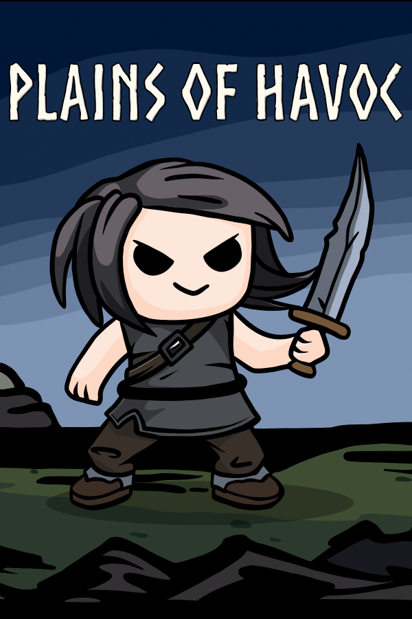



   

      <h1>Plains of Havoc Press Kit</h1>
      

         

            
            <nav class="nav flex-column">
               <a class="nav-link" href="#factsheet" target="_self">Factsheet</a>
               <a class="nav-link" href="#description" target="_self">Description</a>
               <a class="nav-link" href="#videos" target="_self">Videos</a>
               <a class="nav-link" href="#images" target="_self">Images</a>
               <a class="nav-link" href="#contact" target="_self">Contact</a>
            </nav>
         

         

            

               

                  <h2 id="factsheet">Factsheet</h2>
                  

                     <strong>Developer: </strong> Tiny Island Games
                     
Founding date: <time datetime="2021-11-29">Nov 2021</time>

                  

                   
                  
<strong>Release Date: </strong> <time datetime="2024-12-31">2024</time>

                  

                     <strong>Platforms: </strong>
                      
                     <a href="https://store.steampowered.com/app/2212550/Plains_of_Havoc/" target="_blank">PC (Steam)</a>
                  

                  

                     <strong>Social</strong>
                      
                     <a href="https://discord.com/invite/rSuwhuSUhj" target="_blank">Discord</a> 
                     <a href="https://twitter.com/tinyislandgames" target="_blank">Twitter</a> 
                     <a href="https://mastodon.social/@tinyislandgames" target="_blank">Mastodon</a> 
                  

               

               

                  <h2 id="description">Description</h2>
                     

                     Decimate endless hordes of enemies across the nine realms of Yggdrasil for eternal glory! Plains of Havoc is a fierce 2D top-down roguelite set in the Viking afterlife in which you fight for your rightful place on the global leaderboards.
                     

                   
                     

                     Fight, die, feast and repeat! Whenever you fall in glorious battle, your levels are sacrificed to unlock powerful permanent upgrades, turning you into a force to be reckoned with. Slain enemies may also leave behind Tribute, which can be used to unlock new weapons and cosmetics to flaunt your wealth in the Great Hall.
                     

                   
                     

                     Power up, equip new weapons, learn from your mistakes and dive back into battle to climb the leaderboards. Experiment with different upgrade combinations to achieve power that will rival Odin himself!
                     

               

            

            

            
            

               

                  <h2>Videos</h2>
                  

                     

                           
                     

                  

                  

                  <h2 id="images">Images</h2>
                     

                        

                        

                     

                     

                        

                        

                     

                  Inspired by <a href="http://dopresskit.com/" target="_blank">presskit()</a> by Rami Ismail (<a href="http://www.vlambeer.com/" target="_blank">Vlambeer</a>)
               

            

         

      

   

   <meta id="pageid" content="presskit" data-game-id="165351" data-full="true">


